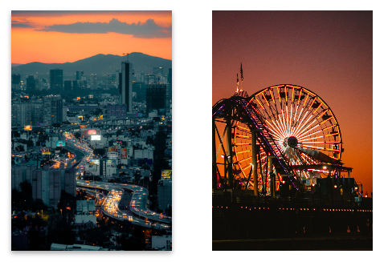

Little training with react-spring, which mainly manages animations. I got help from: https://garden.bradwoods.io/notes/react-spring#examples

React-spring is very complete, and quite difficult to learn, but I'm happy with the result, which I got quite quickly with the help of the documentation. Looking forward to integrating it into my future projects!

##See live :
https://react3-d-card-animation.vercel.app/

